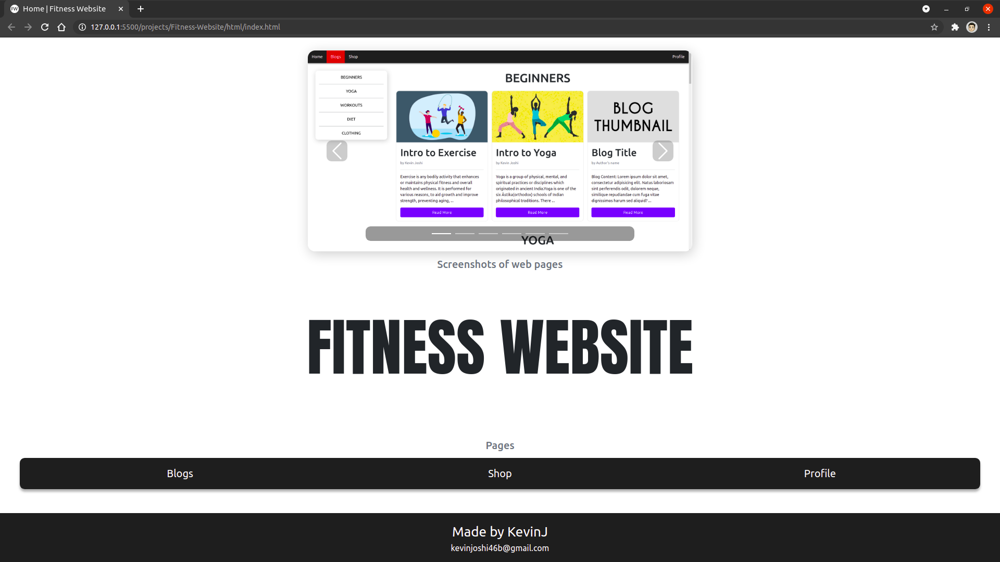
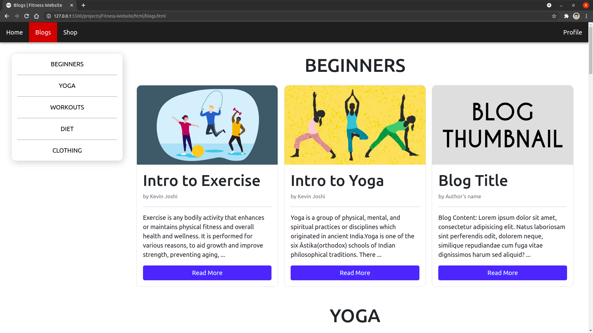
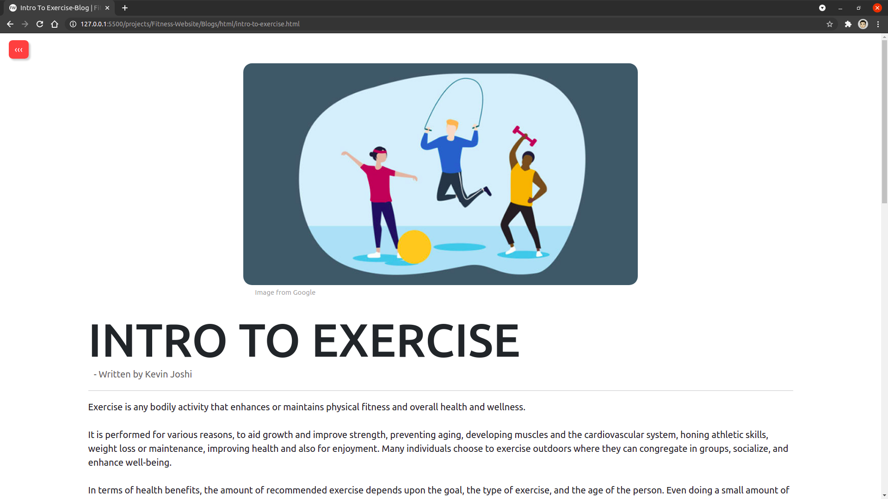
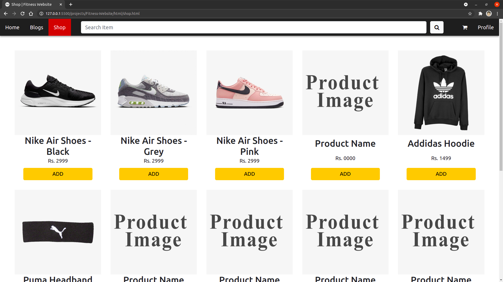
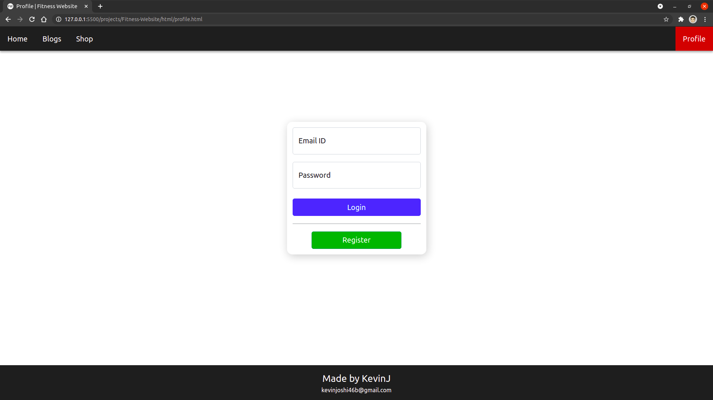
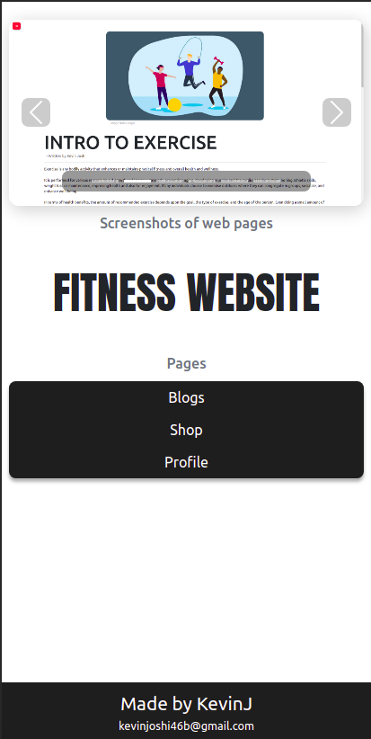
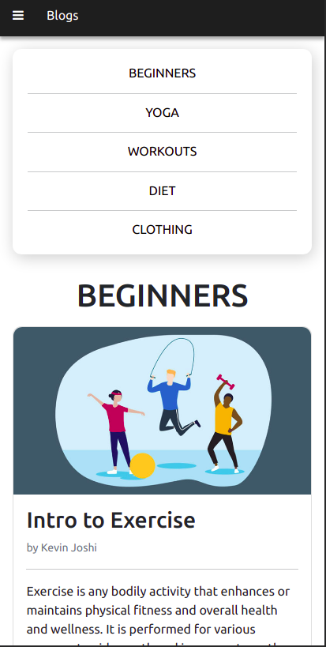
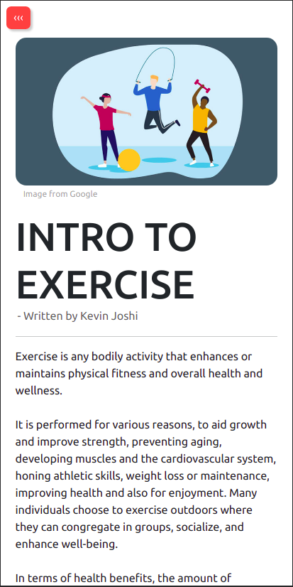
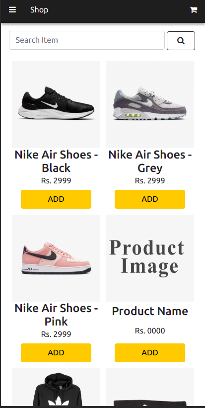
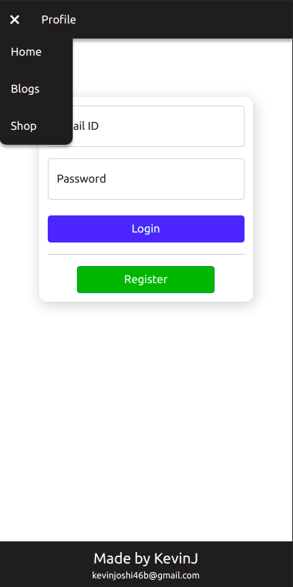

# FITNESS WEBSITE

This a project made by [Kevin Joshi](https://github.com/KevinJ-hub).  
The website has 4 major pages (Home, Blog, Shop, Profile).  
The whole website has been made flexible and has been developed for desktop and mobile devices.

## Tech Used

- HTML
- CSS
- Bootstrap
- JS
- AgularJS

## Running this project

> Make sure your PC is connected to the internet (if not Bootstrap and AgularJS won't work)

1. Clone this repository
2. Open the file in the following directory

```
/html/index.html
```

## Images

### Desktop


---

---

---

---


### Mobile Devices

|  |  |  |  |  |
|---|---|---|---|---|
